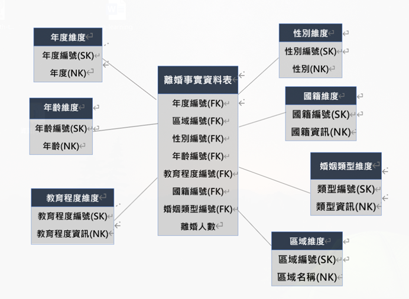

# Information-Visualization
主題：台灣離婚人口背景分析(以109、110年為例)  
[點一下來查看]([URL](https://app.powerbi.com/view?r=eyJrIjoiMzYzOWE2NzQtZTQ2My00NTE3LWI1NDQtM2YyNTQ5YzhlOWUxIiwidCI6IjM5OTIzMmZiLTE3ZDEtNDVjYS1iZGE2LTViNTQwNDQxYmQ2MiIsImMiOjEwfQ%3D%3D&pageName=ReportSection))  
資料來源：政府資料開放平台(戶政司)  
維度模型：  
  
分析工具：Microsoft Power BI  
分析：  
I.	目的：  
根據近兩年台灣各地區離婚資訊，判斷離婚率是否與個人背景有相關性。  
II.	視覺效果：  
交叉分析篩選器、填滿地圖、組合圖、橫條圖
